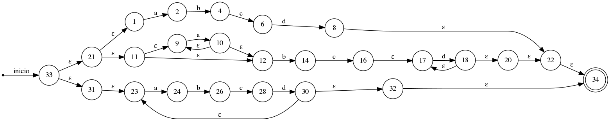

# Practica 1

## Convierte una expresion regular a un AFN

Este programa lo que hace es recibir una expresion regular a traves de los argumentos y como salida devuelve un archivo .gv que es el AFN y es compilado por el mismo programa a una imagen png

**Modo de uso:**

- gcc main.c

- ./a.out "abcd|a*bcd+|(abcd)+"  **Puede ser cualquier otra Expresion Regular**

**Salida:**

